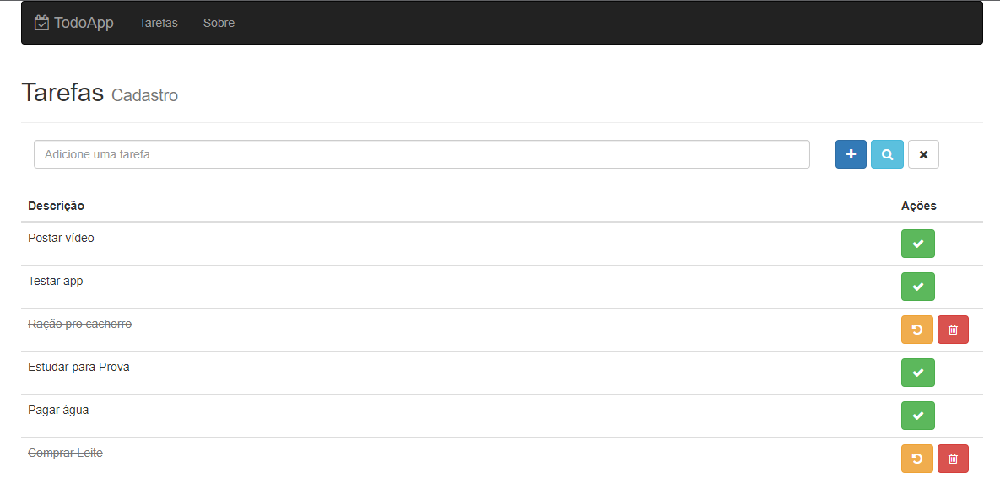

<h1 align="center">Todo List com React-Redux </h1>

 🚀 Estudo de Redux

<h1 align="center"></h1>

•
 <a href="#objetivo">Objetivo</a> •
 <a href="#conclusões">Conclusões</a> •
 <a href="#tecnologias">Tecnologias</a> • 
 <a href="#autor">Autor</a> •

<h1 align="center">
    
    
</h1>

## **Objetivo**

 🔠Testar aplicações com o Redux 

## **Conclusões**

 🔠Algum evento dispara um <strong> Action Creator </strong> que por sua vez cria uma <strong> Action </strong> que contém um TYPE e opcionalmente algum dado (PAYLOAD). Essa <strong> Action </strong> é enviada para todos os <strong> Reducers </strong> que possuem a função de, caso seja vinculado a essa Action, alterar algum atributo do <strong> State </strong> que é clonado e substituido por sua nova versão.  

## **Tecnologias**

<ul>⚙️ Backend
    <li>🛠 Mongodb
    <li>🛠 Express
    <li>🛠 Mongoose
</ul>
<ul>⚙️ Frontend
    <li>🛠 Axios
    <li>🛠 Redux
    <li>🛠 React
    <li>🛠 Bootstrap
    <li>🛠 font-awesome

## **Autor**

 Desenvolvido por <a href="https://github.com/valtercfjunior">Valter Junior</a> 

 Créditos: <a href="https://www.cod3r.com.br/">Cod3r</a> 

